# Paso 03 — Diagrama entidad-relación (Mermaid)

**Workflow:** 02_database_workflow — Paso 03
**Entrada:** `02_modelo_conceptual/modelo_conceptual.md`
**Restricción:** sin SQL, sin tipos de motor. Notación: entidad `Nombre`; N:M como entidad asociativa; FK conceptual con `||--o{`.

## 1. Diagrama

```mermaid
erDiagram
    Usuario ||--o{ UsuarioRol : tiene
    Rol ||--o{ UsuarioRol : asignado
    Rol ||--o{ RolPermiso : contiene
    Permiso ||--o{ RolPermiso : concede
    Usuario ||--o{ Auditoria : registra
    Usuario ||--o{ MovimientoInventario : ejecuta
    Usuario ||--o{ AjusteStock : autoriza
    Usuario ||--o{ Transferencia : promueve
    Usuario ||--o{ Recepcion : confirma

    Sucursal ||--o{ CajaPos : opera
    Sucursal ||--o{ Inventario : posee
    Sucursal ||--o{ OrdenVenta : atiende
    Sucursal ||--o{ Transferencia : origina
    Sucursal ||--o{ Transferencia : destino

    Categoria ||--o{ Categoria : padre
    Categoria ||--o{ Producto : agrupa
    Producto ||--o{ Precio : tiene
    Sucursal ||--o{ Precio : fija
    Producto ||--o{ ProductoPromocion : incluye
    Promocion ||--o{ ProductoPromocion : aplica
    Producto ||--|| Inventario : stock_en
    Producto ||--o{ OrdenVentaItem : detalle
    Producto ||--o{ OrdenDevolucionItem : devuelve
    Producto ||--o{ CarritoWebItem : en_carrito
    Producto ||--o{ OrdenCompraItem : solicita
    Producto ||--o{ RecepcionItem : recibe
    Producto ||--o{ TransferenciaItem : transfiere
    Producto ||--o{ MovimientoInventario : afecta
    Producto ||--o{ AjusteStock : corrige
    Producto ||--o{ Reserva : reserva

    Cliente ||--o{ OrdenVenta : compra
    Cliente ||--o{ OrdenDevolucion : solicita
    Cliente ||--o{ CarritoWeb : inicia

    Proveedor ||--o{ OrdenCompra : provee
    OrdenCompra ||--o{ OrdenCompraItem : contiene
    OrdenCompra ||--o{ Recepcion : recibe
    Recepcion ||--o{ RecepcionItem : detalla

    OrdenVenta ||--o{ OrdenVentaItem : detalle
    OrdenVenta ||--o{ Reserva : asegura
    OrdenVenta ||--o{ PagoTransaccion : paga
    OrdenVenta ||--o{ OrdenDevolucion : devuelve
    OrdenVenta ||--o{ MovimientoInventario : origina
    OrdenVenta ||--o{ OutboxEvento : emite

    Recepcion ||--o{ MovimientoInventario : origina
    AjusteStock ||--o{ MovimientoInventario : origina
    Transferencia ||--o{ TransferenciaItem : contiene
    Transferencia ||--o{ MovimientoInventario : origina
    OrdenDevolucion ||--o{ OrdenDevolucionItem : detalla
    OrdenDevolucion ||--o{ MovimientoInventario : origina

    CarritoWeb ||--o{ CarritoWebItem : contiene
    PagoTransaccion ||--o{ OutboxEvento : emite

    ConfiguracionSistema {
        string clave PK
        string valor
    }
    IdempotencyKey {
        string key PK
        string operacion
        datetime expiracion
    }
    TokenBlacklist {
        string hash PK
        datetime expiracion
    }
    Auditoria {
        string accion
        string entidad
        string usuario
        datetime fecha
    }
    MovimientoInventario {
        string tipo
        int cantidad
        string referencia
        datetime fecha
    }
    Reserva {
        string estado
        datetime expira_en
    }
```

## 2. Leyenda de cardinalidades

- `||--o{` uno a muchos (1:N).
- `Producto ||--|| Inventario` unicidad del par producto↔sucursal (R10; en el modelo lógico se resuelve con clave compuesta o surrogate + UNIQUE).
- N:M ya materializadas: `UsuarioRol`, `RolPermiso`, `ProductoPromocion`.
- Entidades débiles/sin figuras en el grafo principal (`ConfiguracionSistema`, `IdempotencyKey`, `TokenBlacklist`) se listan como nodos independientes; se relacionan por referencia lógica (orden → idempotency; no son dominio).

## 3. Cobertura

- RF-001…RF-100 mapeados en `modelo_conceptual.md` §2; el grafo no añade entidades nuevas.
- RN-01…RN-08: representadas por `MovimientoInventario` (append-only con referencia), `Reserva.estado/expira_en`, `OrdenDevolucion` como entidad nueva, referencias únicas en Pago/OrdenVenta.
- Pendientes DB-P01…DB-P12 sin resolver: no se cierran en este diagrama.

**Estado:** Paso 03 COMPLETADO → siguiente: Paso 04 (`03_modelo_logico/modelo_logico.md`).
