# Documentación de la base de datos real — sistema omnicanal

> **Paso 18** — Verificación y documentación de la base real  
> Fuente: introspección viva de ``sistema`` en ``localhost:3306`` (MySQL 8.4.3)  
> Fecha: 2026-09-22  
> Comparación: ``proyecto/05_base_datos/05_modelo_fisico/modelo_fisico.md`` (diseño) vs esquema desplegado

---

## 1. Gate de conteo (count / identity)

| Métrica | Diseño (modelo_fisico) | Real (information_schema) | Diff |
|---|---:|---:|---:|
| Tablas base | 36 | **36** | 0 |
| Columnas | 338 | **338** | 0 |
| FK | 48 | **48** | 0 |
| Nombres FK (``fk_*``) | 48 | **48** | 0 |
| CHECK | 22 | **22** | 0 |
| UNIQUE (constraint/index) | 24 | **24** | 0 |
| Triggers | 4 (V008) | **4** | 0 |
| Definiciones de índice (incl. PRIMARY) | — | **108** | — |
| Partes de índice (filas STATISTICS) | — | **131** | — |
| Columnas de PRIMARY (compuestos) | — | **39** | — |
| Vistas / Rutinas / Eventos | 0 | **0 / 0 / 0** | 0 |

**Resultado del gate: PASS** — conjuntos de tablas idénticos (sin faltantes ni sobrantes); nombres de FK y CHECK idénticos 1:1; 0 diffs de tipo base en 338 columnas.

### Detalle de triggers (V008)

| Trigger | Tabla | Timing | Evento | Efecto |
|---|---|---|---|---|
| ``trg_core_auditoria_no_update`` | ``core_auditoria`` | BEFORE | UPDATE | SIGNAL 45000 — append-only |
| ``trg_core_auditoria_no_delete`` | ``core_auditoria`` | BEFORE | DELETE | SIGNAL 45000 — append-only |
| ``trg_inv_movimiento_no_update`` | ``inv_movimiento_inventario`` | BEFORE | UPDATE | SIGNAL 45000 — append-only |
| ``trg_inv_movimiento_no_delete`` | ``inv_movimiento_inventario`` | BEFORE | DELETE | SIGNAL 45000 — append-only |

### Identidad del servidor

| Campo | Valor |
|---|---|
| Versión | MySQL Community Server **8.4.3** |
| Host | ``DESKTOP-C98TO9G``:3306 |
| Esquema documentado | ``sistema`` |
| Charset / collation servidor | ``utf8mb4`` / ``utf8mb4_0900_ai_ci`` |
| Collation tablas | ``utf8mb4_unicode_ci`` |
| Engine | InnoDB (36/36) |

---

## 2. ERD real (Mermaid — nivel tabla)

```mermaid
erDiagram
auth_permiso ||--o{ auth_rol_permiso : ref
auth_rol ||--o{ auth_rol_permiso : ref
auth_rol ||--o{ auth_usuario_rol : ref
auth_usuario ||--o{ auth_usuario_rol : ref
auth_usuario ||--o{ com_recepcion : ref
auth_usuario ||--o{ core_auditoria : ref
auth_usuario ||--o{ inv_ajuste_stock : ref
auth_usuario ||--o{ inv_movimiento_inventario : ref
auth_usuario ||--o{ inv_transferencia : ref
auth_usuario ||--o{ sales_devolucion : ref
cat_categoria ||--o{ cat_categoria : ref
cat_categoria ||--o{ cat_producto : ref
cat_producto ||--o{ cat_precio : ref
cat_producto ||--o{ com_orden_compra_item : ref
cat_producto ||--o{ com_producto_promocion : ref
cat_producto ||--o{ com_recepcion_item : ref
cat_producto ||--o{ inv_inventario : ref
cat_producto ||--o{ inv_movimiento_inventario : ref
cat_producto ||--o{ inv_transferencia_item : ref
cat_producto ||--o{ sales_carrito_web_item : ref
cat_producto ||--o{ sales_devolucion_item : ref
cat_producto ||--o{ sales_orden_venta_item : ref
cat_promocion ||--o{ com_producto_promocion : ref
com_orden_compra ||--o{ com_orden_compra_item : ref
com_orden_compra ||--o{ com_recepcion : ref
com_proveedor ||--o{ com_orden_compra : ref
com_recepcion ||--o{ com_recepcion_item : ref
core_cliente ||--o{ sales_carrito_web : ref
core_cliente ||--o{ sales_devolucion : ref
core_cliente ||--o{ sales_orden_venta : ref
core_sucursal ||--o{ cat_precio : ref
core_sucursal ||--o{ core_caja_pos : ref
core_sucursal ||--o{ inv_inventario : ref
core_sucursal ||--o{ inv_movimiento_inventario : ref
core_sucursal ||--o{ inv_transferencia : ref
core_sucursal ||--o{ sales_orden_venta : ref
inv_inventario ||--o{ inv_ajuste_stock : ref
inv_inventario ||--o{ inv_movimiento_inventario : ref
inv_inventario ||--o{ inv_reserva : ref
inv_transferencia ||--o{ inv_transferencia_item : ref
sales_carrito_web ||--o{ sales_carrito_web_item : ref
sales_devolucion ||--o{ sales_devolucion_item : ref
sales_orden_venta ||--o{ inv_reserva : ref
sales_orden_venta ||--o{ pay_transaccion_pago : ref
sales_orden_venta ||--o{ sales_devolucion : ref
sales_orden_venta ||--o{ sales_orden_venta_item : ref
sales_orden_venta_item ||--o{ sales_devolucion_item : ref
```



> 47 relaciones únicas por par de tablas (48 FK; ``cat_categoria`` → ``cat_categoria`` es la autorreferencia de jerarquía).

### Dominios de prefijo

| Dominio | Tablas | Prefijo |
|---|---|---|
| Auth / identidad | 6 | ``auth_`` |
| Núcleo (sucursales, clientes, auditoría) | 6 | ``core_`` |
| Catálogo | 4 | ``cat_`` |
| Compras | 6 | ``com_`` |
| Inventario | 6 | ``inv_`` |
| Ventas / canal web | 6 | ``sales_`` |
| Pagos | 2 | ``pay_`` |
| **Total** | **36** | |

---

## 3. Diccionario de datos (por tabla)

Columnas de la **base real** (``information_schema.COLUMNS``).  
Convenciones: ``PRI`` = clave primaria · ``UNI`` = única · ``MUL`` = índice no único · ``Extra`` incluye ``auto_increment``.

### auth_permiso

| Column | Type | Nullable | Default | Key | Extra |
|---|---|---|---|---|---|
| `id` | bigint unsigned | NO |  | PRI | auto_increment |
| `codigo` | varchar(64) | NO |  | UNI |  |
| `descripcion` | varchar(255) | YES |  |  |  |
| `estado` | enum('activo','inactivo') | NO | `activo` |  |  |
| `user_create` | bigint unsigned | NO |  |  |  |
| `user_update` | bigint unsigned | NO |  |  |  |
| `user_created_at` | datetime | NO |  |  |  |
| `user_update_at` | datetime | NO |  |  |  |

**UNIQUE:** `uq_auth_permiso_codigo`(`codigo`)

### auth_rol

| Column | Type | Nullable | Default | Key | Extra |
|---|---|---|---|---|---|
| `id` | bigint unsigned | NO |  | PRI | auto_increment |
| `nombre` | varchar(80) | NO |  | UNI |  |
| `estado` | enum('activo','inactivo') | NO | `activo` |  |  |
| `user_create` | bigint unsigned | NO |  |  |  |
| `user_update` | bigint unsigned | NO |  |  |  |
| `user_created_at` | datetime | NO |  |  |  |
| `user_update_at` | datetime | NO |  |  |  |

**UNIQUE:** `uq_auth_rol_nombre`(`nombre`)

### auth_rol_permiso

| Column | Type | Nullable | Default | Key | Extra |
|---|---|---|---|---|---|
| `rol_id` | bigint unsigned | NO |  | PRI |  |
| `permiso_id` | bigint unsigned | NO |  | PRI |  |
| `user_create` | bigint unsigned | NO |  |  |  |
| `user_update` | bigint unsigned | NO |  |  |  |
| `user_created_at` | datetime | NO |  |  |  |
| `user_update_at` | datetime | NO |  |  |  |

**FK:** `fk_auth_rol_permiso_permiso` → `auth_permiso.id` (`permiso_id`); `fk_auth_rol_permiso_rol` → `auth_rol.id` (`rol_id`)

### auth_token_blacklist

| Column | Type | Nullable | Default | Key | Extra |
|---|---|---|---|---|---|
| `id` | bigint unsigned | NO |  | PRI | auto_increment |
| `token_hash` | varchar(64) | NO |  | UNI |  |
| `expira_en` | datetime | NO |  | MUL |  |
| `creado_en` | datetime | NO |  |  |  |

**UNIQUE:** `uq_auth_token_blacklist_hash`(`token_hash`)

### auth_usuario

| Column | Type | Nullable | Default | Key | Extra |
|---|---|---|---|---|---|
| `id` | bigint unsigned | NO |  | PRI | auto_increment |
| `nombre` | varchar(120) | NO |  |  |  |
| `email` | varchar(254) | NO |  | UNI |  |
| `hash_password` | varchar(255) | NO |  |  |  |
| `estado` | enum('activo','inactivo') | NO | `activo` |  |  |
| `user_create` | bigint unsigned | NO |  |  |  |
| `user_update` | bigint unsigned | NO |  |  |  |
| `user_created_at` | datetime | NO |  |  |  |
| `user_update_at` | datetime | NO |  |  |  |

**UNIQUE:** `uq_auth_usuario_email`(`email`)

### auth_usuario_rol

| Column | Type | Nullable | Default | Key | Extra |
|---|---|---|---|---|---|
| `usuario_id` | bigint unsigned | NO |  | PRI |  |
| `rol_id` | bigint unsigned | NO |  | PRI |  |
| `user_create` | bigint unsigned | NO |  |  |  |
| `user_update` | bigint unsigned | NO |  |  |  |
| `user_created_at` | datetime | NO |  |  |  |
| `user_update_at` | datetime | NO |  |  |  |

**FK:** `fk_auth_usuario_rol_rol` → `auth_rol.id` (`rol_id`); `fk_auth_usuario_rol_usuario` → `auth_usuario.id` (`usuario_id`)

### cat_categoria

| Column | Type | Nullable | Default | Key | Extra |
|---|---|---|---|---|---|
| `id` | bigint unsigned | NO |  | PRI | auto_increment |
| `nombre` | varchar(100) | NO |  |  |  |
| `categoria_padre_id` | bigint unsigned | YES |  | MUL |  |
| `estado` | enum('activo','inactivo') | NO | `activo` |  |  |
| `user_create` | bigint unsigned | NO |  |  |  |
| `user_update` | bigint unsigned | NO |  |  |  |
| `user_created_at` | datetime | NO |  |  |  |
| `user_update_at` | datetime | NO |  |  |  |

**FK:** `fk_cat_categoria_padre` → `cat_categoria.id` (`categoria_padre_id`)

### cat_precio

| Column | Type | Nullable | Default | Key | Extra |
|---|---|---|---|---|---|
| `id` | bigint unsigned | NO |  | PRI | auto_increment |
| `sucursal_id` | bigint unsigned | NO |  | MUL |  |
| `producto_id` | bigint unsigned | NO |  | MUL |  |
| `monto` | decimal(12,2) | NO |  |  |  |
| `moneda` | char(3) | NO |  |  |  |
| `vigente_desde` | datetime | NO |  |  |  |
| `vigente_hasta` | datetime | YES |  |  |  |
| `user_create` | bigint unsigned | NO |  |  |  |
| `user_update` | bigint unsigned | NO |  |  |  |
| `user_created_at` | datetime | NO |  |  |  |
| `user_update_at` | datetime | NO |  |  |  |

**FK:** `fk_cat_precio_producto` → `cat_producto.id` (`producto_id`); `fk_cat_precio_sucursal` → `core_sucursal.id` (`sucursal_id`)

**UNIQUE:** `uq_cat_precio_sucursal_producto_desde`(`sucursal_id,producto_id,vigente_desde`)

### cat_producto

| Column | Type | Nullable | Default | Key | Extra |
|---|---|---|---|---|---|
| `id` | bigint unsigned | NO |  | PRI | auto_increment |
| `sku` | varchar(64) | NO |  | UNI |  |
| `nombre` | varchar(150) | NO |  |  |  |
| `categoria_id` | bigint unsigned | NO |  | MUL |  |
| `unidad` | varchar(32) | NO |  |  |  |
| `estado` | enum('activo','inactivo') | NO | `activo` |  |  |
| `user_create` | bigint unsigned | NO |  |  |  |
| `user_update` | bigint unsigned | NO |  |  |  |
| `user_created_at` | datetime | NO |  |  |  |
| `user_update_at` | datetime | NO |  |  |  |

**FK:** `fk_cat_producto_categoria` → `cat_categoria.id` (`categoria_id`)

**UNIQUE:** `uq_cat_producto_sku`(`sku`)

### cat_promocion

| Column | Type | Nullable | Default | Key | Extra |
|---|---|---|---|---|---|
| `id` | bigint unsigned | NO |  | PRI | auto_increment |
| `nombre` | varchar(120) | NO |  |  |  |
| `reglas` | json | NO |  |  |  |
| `vigente_desde` | datetime | NO |  |  |  |
| `vigente_hasta` | datetime | YES |  |  |  |
| `estado` | enum('activo','inactivo') | NO | `activo` |  |  |
| `user_create` | bigint unsigned | NO |  |  |  |
| `user_update` | bigint unsigned | NO |  |  |  |
| `user_created_at` | datetime | NO |  |  |  |
| `user_update_at` | datetime | NO |  |  |  |

### com_orden_compra

| Column | Type | Nullable | Default | Key | Extra |
|---|---|---|---|---|---|
| `id` | bigint unsigned | NO |  | PRI | auto_increment |
| `numero` | varchar(32) | NO |  | UNI |  |
| `proveedor_id` | bigint unsigned | NO |  | MUL |  |
| `estado` | enum('draft','enviada','recibida','cancelada') | NO | `draft` |  |  |
| `fecha_orden` | datetime | NO |  |  |  |
| `total` | decimal(12,2) | NO | `0.00` |  |  |
| `user_create` | bigint unsigned | NO |  |  |  |
| `user_update` | bigint unsigned | NO |  |  |  |
| `user_created_at` | datetime | NO |  |  |  |
| `user_update_at` | datetime | NO |  |  |  |

**FK:** `fk_com_orden_compra_proveedor` → `com_proveedor.id` (`proveedor_id`)

**UNIQUE:** `uq_com_orden_compra_numero`(`numero`)

### com_orden_compra_item

| Column | Type | Nullable | Default | Key | Extra |
|---|---|---|---|---|---|
| `id` | bigint unsigned | NO |  | PRI | auto_increment |
| `orden_id` | bigint unsigned | NO |  | MUL |  |
| `producto_id` | bigint unsigned | NO |  | MUL |  |
| `cantidad` | int unsigned | NO |  |  |  |
| `precio_pactado` | decimal(12,2) | NO |  |  |  |
| `user_create` | bigint unsigned | NO |  |  |  |
| `user_update` | bigint unsigned | NO |  |  |  |
| `user_created_at` | datetime | NO |  |  |  |
| `user_update_at` | datetime | NO |  |  |  |

**FK:** `fk_com_orden_item_orden` → `com_orden_compra.id` (`orden_id`); `fk_com_orden_item_producto` → `cat_producto.id` (`producto_id`)

**UNIQUE:** `uq_com_orden_item_orden_producto`(`orden_id,producto_id`)

### com_producto_promocion

| Column | Type | Nullable | Default | Key | Extra |
|---|---|---|---|---|---|
| `producto_id` | bigint unsigned | NO |  | PRI |  |
| `promocion_id` | bigint unsigned | NO |  | PRI |  |
| `user_create` | bigint unsigned | NO |  |  |  |
| `user_update` | bigint unsigned | NO |  |  |  |
| `user_created_at` | datetime | NO |  |  |  |
| `user_update_at` | datetime | NO |  |  |  |

**FK:** `fk_com_producto_promocion_producto` → `cat_producto.id` (`producto_id`); `fk_com_producto_promocion_promo` → `cat_promocion.id` (`promocion_id`)

### com_proveedor

| Column | Type | Nullable | Default | Key | Extra |
|---|---|---|---|---|---|
| `id` | bigint unsigned | NO |  | PRI | auto_increment |
| `nombre` | varchar(150) | NO |  | UNI |  |
| `codigo` | varchar(32) | YES |  | UNI |  |
| `contacto` | varchar(150) | YES |  |  |  |
| `estado` | enum('activo','inactivo') | NO | `activo` |  |  |
| `user_create` | bigint unsigned | NO |  |  |  |
| `user_update` | bigint unsigned | NO |  |  |  |
| `user_created_at` | datetime | NO |  |  |  |
| `user_update_at` | datetime | NO |  |  |  |

**UNIQUE:** `uq_com_proveedor_codigo`(`codigo`); `uq_com_proveedor_nombre`(`nombre`)

### com_recepcion

| Column | Type | Nullable | Default | Key | Extra |
|---|---|---|---|---|---|
| `id` | bigint unsigned | NO |  | PRI | auto_increment |
| `orden_id` | bigint unsigned | NO |  | MUL |  |
| `estado` | enum('draft','confirmada') | NO | `draft` |  |  |
| `fecha` | datetime | NO |  |  |  |
| `usuario_confirma` | bigint unsigned | YES |  | MUL |  |
| `user_create` | bigint unsigned | NO |  |  |  |
| `user_update` | bigint unsigned | NO |  |  |  |
| `user_created_at` | datetime | NO |  |  |  |
| `user_update_at` | datetime | NO |  |  |  |

**FK:** `fk_com_recepcion_orden` → `com_orden_compra.id` (`orden_id`); `fk_com_recepcion_usuario` → `auth_usuario.id` (`usuario_confirma`)

### com_recepcion_item

| Column | Type | Nullable | Default | Key | Extra |
|---|---|---|---|---|---|
| `id` | bigint unsigned | NO |  | PRI | auto_increment |
| `recepcion_id` | bigint unsigned | NO |  | MUL |  |
| `producto_id` | bigint unsigned | NO |  | MUL |  |
| `cantidad_recibida` | int unsigned | NO |  |  |  |
| `user_create` | bigint unsigned | NO |  |  |  |
| `user_update` | bigint unsigned | NO |  |  |  |
| `user_created_at` | datetime | NO |  |  |  |
| `user_update_at` | datetime | NO |  |  |  |

**FK:** `fk_com_recepcion_item_producto` → `cat_producto.id` (`producto_id`); `fk_com_recepcion_item_recepcion` → `com_recepcion.id` (`recepcion_id`)

**UNIQUE:** `uq_com_recepcion_item_recepcion_producto`(`recepcion_id,producto_id`)

### core_auditoria

| Column | Type | Nullable | Default | Key | Extra |
|---|---|---|---|---|---|
| `id` | bigint unsigned | NO |  | PRI | auto_increment |
| `accion` | varchar(50) | NO |  |  |  |
| `entidad_tipo` | varchar(80) | NO |  | MUL |  |
| `entidad_id` | bigint unsigned | NO |  |  |  |
| `datos_previos` | text | YES |  |  |  |
| `datos_nuevos` | text | YES |  |  |  |
| `usuario_id` | bigint unsigned | NO |  | MUL |  |
| `motivo` | text | YES |  |  |  |
| `fecha` | datetime | NO |  | MUL |  |
| `correlation_id` | varchar(64) | YES |  |  |  |
| `user_create` | bigint unsigned | NO |  |  |  |
| `user_update` | bigint unsigned | NO |  |  |  |
| `user_created_at` | datetime | NO |  |  |  |
| `user_update_at` | datetime | NO |  |  |  |

**FK:** `fk_core_auditoria_usuario` → `auth_usuario.id` (`usuario_id`)

### core_caja_pos

| Column | Type | Nullable | Default | Key | Extra |
|---|---|---|---|---|---|
| `id` | bigint unsigned | NO |  | PRI | auto_increment |
| `sucursal_id` | bigint unsigned | NO |  | MUL |  |
| `codigo` | varchar(32) | NO |  |  |  |
| `estado` | enum('activo','inactivo') | NO | `activo` |  |  |
| `user_create` | bigint unsigned | NO |  |  |  |
| `user_update` | bigint unsigned | NO |  |  |  |
| `user_created_at` | datetime | NO |  |  |  |
| `user_update_at` | datetime | NO |  |  |  |

**FK:** `fk_core_caja_pos_sucursal` → `core_sucursal.id` (`sucursal_id`)

**UNIQUE:** `uq_core_caja_pos_sucursal_codigo`(`sucursal_id,codigo`)

### core_cliente

| Column | Type | Nullable | Default | Key | Extra |
|---|---|---|---|---|---|
| `id` | bigint unsigned | NO |  | PRI | auto_increment |
| `nombre` | varchar(150) | NO |  |  |  |
| `razon_social` | varchar(150) | YES |  |  |  |
| `identificacion` | varchar(32) | YES |  | UNI |  |
| `email` | varchar(254) | YES |  | MUL |  |
| `telefono` | varchar(32) | YES |  |  |  |
| `estado` | enum('activo','inactivo') | NO | `activo` |  |  |
| `user_create` | bigint unsigned | NO |  |  |  |
| `user_update` | bigint unsigned | NO |  |  |  |
| `user_created_at` | datetime | NO |  |  |  |
| `user_update_at` | datetime | NO |  |  |  |

**UNIQUE:** `uq_core_cliente_identificacion`(`identificacion`)

### core_configuracion

| Column | Type | Nullable | Default | Key | Extra |
|---|---|---|---|---|---|
| `id` | bigint unsigned | NO |  | PRI | auto_increment |
| `clave` | varchar(80) | NO |  | UNI |  |
| `valor` | text | NO |  |  |  |
| `descripcion` | varchar(255) | YES |  |  |  |
| `user_create` | bigint unsigned | NO |  |  |  |
| `user_update` | bigint unsigned | NO |  |  |  |
| `user_created_at` | datetime | NO |  |  |  |
| `user_update_at` | datetime | NO |  |  |  |

**UNIQUE:** `uq_core_config_clave`(`clave`)

### core_idempotency_key

| Column | Type | Nullable | Default | Key | Extra |
|---|---|---|---|---|---|
| `key` | char(36) | NO |  | PRI |  |
| `operacion` | varchar(80) | NO |  |  |  |
| `respuesta` | mediumtext | YES |  |  |  |
| `expiracion` | datetime | NO |  | MUL |  |
| `creado_en` | datetime | NO |  |  |  |

### core_sucursal

| Column | Type | Nullable | Default | Key | Extra |
|---|---|---|---|---|---|
| `id` | bigint unsigned | NO |  | PRI | auto_increment |
| `nombre` | varchar(120) | NO |  |  |  |
| `direccion` | varchar(255) | YES |  |  |  |
| `estado` | enum('activo','inactivo') | NO | `activo` |  |  |
| `user_create` | bigint unsigned | NO |  |  |  |
| `user_update` | bigint unsigned | NO |  |  |  |
| `user_created_at` | datetime | NO |  |  |  |
| `user_update_at` | datetime | NO |  |  |  |

### inv_ajuste_stock

| Column | Type | Nullable | Default | Key | Extra |
|---|---|---|---|---|---|
| `id` | bigint unsigned | NO |  | PRI | auto_increment |
| `inventario_id` | bigint unsigned | NO |  | MUL |  |
| `cantidad` | int | NO |  |  |  |
| `motivo` | text | NO |  |  |  |
| `usuario_id` | bigint unsigned | NO |  | MUL |  |
| `fecha` | datetime | NO |  |  |  |
| `user_create` | bigint unsigned | NO |  |  |  |
| `user_update` | bigint unsigned | NO |  |  |  |
| `user_created_at` | datetime | NO |  |  |  |
| `user_update_at` | datetime | NO |  |  |  |

**FK:** `fk_inv_ajuste_inventario` → `inv_inventario.id` (`inventario_id`); `fk_inv_ajuste_usuario` → `auth_usuario.id` (`usuario_id`)

### inv_inventario

| Column | Type | Nullable | Default | Key | Extra |
|---|---|---|---|---|---|
| `id` | bigint unsigned | NO |  | PRI | auto_increment |
| `producto_id` | bigint unsigned | NO |  | MUL |  |
| `sucursal_id` | bigint unsigned | NO |  | MUL |  |
| `stock_available` | int unsigned | NO | `0` |  |  |
| `stock_reserved` | int unsigned | NO | `0` |  |  |
| `stock_sold` | int unsigned | NO | `0` |  |  |
| `version` | int unsigned | NO | `0` |  |  |
| `user_create` | bigint unsigned | NO |  |  |  |
| `user_update` | bigint unsigned | NO |  |  |  |
| `user_created_at` | datetime | NO |  |  |  |
| `user_update_at` | datetime | NO |  |  |  |

**FK:** `fk_inv_inventario_producto` → `cat_producto.id` (`producto_id`); `fk_inv_inventario_sucursal` → `core_sucursal.id` (`sucursal_id`)

**UNIQUE:** `uq_inv_inventario_producto_sucursal`(`producto_id,sucursal_id`)

### inv_movimiento_inventario

| Column | Type | Nullable | Default | Key | Extra |
|---|---|---|---|---|---|
| `id` | bigint unsigned | NO |  | PRI | auto_increment |
| `inventario_id` | bigint unsigned | NO |  | MUL |  |
| `producto_id` | bigint unsigned | NO |  | MUL |  |
| `sucursal_id` | bigint unsigned | NO |  | MUL |  |
| `tipo` | enum('entrada','salida','reserva','liberacion','ajuste','devolucion','transferencia_salida','transferencia_entrada','recepcion') | NO |  |  |  |
| `cantidad` | int | NO |  |  |  |
| `referencia_tipo` | varchar(50) | YES |  |  |  |
| `referencia_id` | bigint unsigned | YES |  |  |  |
| `usuario_id` | bigint unsigned | NO |  | MUL |  |
| `motivo` | text | YES |  |  |  |
| `fecha` | datetime | NO |  |  |  |
| `user_create` | bigint unsigned | NO |  |  |  |
| `user_update` | bigint unsigned | NO |  |  |  |
| `user_created_at` | datetime | NO |  |  |  |
| `user_update_at` | datetime | NO |  |  |  |

**FK:** `fk_inv_mov_inventario` → `inv_inventario.id` (`inventario_id`); `fk_inv_mov_producto` → `cat_producto.id` (`producto_id`); `fk_inv_mov_sucursal` → `core_sucursal.id` (`sucursal_id`); `fk_inv_mov_usuario` → `auth_usuario.id` (`usuario_id`)

### inv_reserva

| Column | Type | Nullable | Default | Key | Extra |
|---|---|---|---|---|---|
| `id` | bigint unsigned | NO |  | PRI | auto_increment |
| `orden_id` | bigint unsigned | NO |  | MUL |  |
| `inventario_id` | bigint unsigned | NO |  | MUL |  |
| `cantidad` | int unsigned | NO |  |  |  |
| `estado` | enum('pending','confirmed','expired','cancelled') | NO | `pending` | MUL |  |
| `expira_en` | datetime | NO |  |  |  |
| `creado_en` | datetime | NO |  |  |  |
| `user_create` | bigint unsigned | NO |  |  |  |
| `user_update` | bigint unsigned | NO |  |  |  |
| `user_created_at` | datetime | NO |  |  |  |
| `user_update_at` | datetime | NO |  |  |  |

**FK:** `fk_inv_reserva_inventario` → `inv_inventario.id` (`inventario_id`); `fk_inv_reserva_orden` → `sales_orden_venta.id` (`orden_id`)

### inv_transferencia

| Column | Type | Nullable | Default | Key | Extra |
|---|---|---|---|---|---|
| `id` | bigint unsigned | NO |  | PRI | auto_increment |
| `sucursal_origen_id` | bigint unsigned | NO |  | MUL |  |
| `sucursal_destino_id` | bigint unsigned | NO |  | MUL |  |
| `estado` | enum('draft','in_transit','received','cancelled') | NO | `draft` |  |  |
| `usuario_id` | bigint unsigned | NO |  | MUL |  |
| `fecha_salida` | datetime | YES |  |  |  |
| `fecha_recepcion` | datetime | YES |  |  |  |
| `user_create` | bigint unsigned | NO |  |  |  |
| `user_update` | bigint unsigned | NO |  |  |  |
| `user_created_at` | datetime | NO |  |  |  |
| `user_update_at` | datetime | NO |  |  |  |

**FK:** `fk_inv_trans_destino` → `core_sucursal.id` (`sucursal_destino_id`); `fk_inv_trans_origen` → `core_sucursal.id` (`sucursal_origen_id`); `fk_inv_trans_usuario` → `auth_usuario.id` (`usuario_id`)

### inv_transferencia_item

| Column | Type | Nullable | Default | Key | Extra |
|---|---|---|---|---|---|
| `id` | bigint unsigned | NO |  | PRI | auto_increment |
| `transferencia_id` | bigint unsigned | NO |  | MUL |  |
| `producto_id` | bigint unsigned | NO |  | MUL |  |
| `cantidad` | int unsigned | NO |  |  |  |
| `user_create` | bigint unsigned | NO |  |  |  |
| `user_update` | bigint unsigned | NO |  |  |  |
| `user_created_at` | datetime | NO |  |  |  |
| `user_update_at` | datetime | NO |  |  |  |

**FK:** `fk_inv_trans_item_producto` → `cat_producto.id` (`producto_id`); `fk_inv_trans_item_trans` → `inv_transferencia.id` (`transferencia_id`)

**UNIQUE:** `uq_inv_trans_item_trans_producto`(`transferencia_id,producto_id`)

### pay_outbox_evento

| Column | Type | Nullable | Default | Key | Extra |
|---|---|---|---|---|---|
| `id` | bigint unsigned | NO |  | PRI | auto_increment |
| `agregado_tipo` | varchar(50) | NO |  |  |  |
| `agregado_id` | bigint unsigned | NO |  |  |  |
| `evento_tipo` | varchar(80) | NO |  |  |  |
| `payload` | json | NO |  |  |  |
| `estado` | enum('pending','processing','processed','failed') | NO | `pending` | MUL |  |
| `claimed_at` | datetime | YES |  |  |  |
| `correlation_id` | varchar(64) | NO |  | MUL |  |
| `creado_en` | datetime | NO |  |  |  |
| `procesado_en` | datetime | YES |  |  |  |
| `reintentos` | int unsigned | NO | `0` |  |  |

### pay_transaccion_pago

| Column | Type | Nullable | Default | Key | Extra |
|---|---|---|---|---|---|
| `id` | bigint unsigned | NO |  | PRI | auto_increment |
| `orden_id` | bigint unsigned | NO |  | MUL |  |
| `proveedor_pago` | varchar(50) | NO |  | MUL |  |
| `referencia_externa` | varchar(120) | NO |  |  |  |
| `monto` | decimal(12,2) | NO |  |  |  |
| `estado` | enum('initiated','authorized','failed','refunded','compensated') | NO | `initiated` |  |  |
| `idempotency_key` | varchar(64) | NO |  | UNI |  |
| `fecha` | datetime | NO |  |  |  |
| `user_create` | bigint unsigned | NO |  |  |  |
| `user_update` | bigint unsigned | NO |  |  |  |
| `user_created_at` | datetime | NO |  |  |  |
| `user_update_at` | datetime | NO |  |  |  |

**FK:** `fk_pay_pago_orden` → `sales_orden_venta.id` (`orden_id`)

**UNIQUE:** `uq_pay_pago_idempotency`(`idempotency_key`); `uq_pay_pago_proveedor_ref`(`proveedor_pago,referencia_externa`)

### sales_carrito_web

| Column | Type | Nullable | Default | Key | Extra |
|---|---|---|---|---|---|
| `id` | bigint unsigned | NO |  | PRI | auto_increment |
| `cliente_id` | bigint unsigned | YES |  | MUL |  |
| `sesion_key` | varchar(64) | NO |  | UNI |  |
| `actualizado_en` | datetime | NO |  |  |  |
| `user_create` | bigint unsigned | NO |  |  |  |
| `user_update` | bigint unsigned | NO |  |  |  |
| `user_created_at` | datetime | NO |  |  |  |
| `user_update_at` | datetime | NO |  |  |  |

**FK:** `fk_sales_carrito_cliente` → `core_cliente.id` (`cliente_id`)

**UNIQUE:** `uq_sales_carrito_sesion`(`sesion_key`)

### sales_carrito_web_item

| Column | Type | Nullable | Default | Key | Extra |
|---|---|---|---|---|---|
| `id` | bigint unsigned | NO |  | PRI | auto_increment |
| `carrito_id` | bigint unsigned | NO |  | MUL |  |
| `producto_id` | bigint unsigned | NO |  | MUL |  |
| `cantidad` | int unsigned | NO |  |  |  |
| `user_create` | bigint unsigned | NO |  |  |  |
| `user_update` | bigint unsigned | NO |  |  |  |
| `user_created_at` | datetime | NO |  |  |  |
| `user_update_at` | datetime | NO |  |  |  |

**FK:** `fk_sales_carrito_item_carrito` → `sales_carrito_web.id` (`carrito_id`); `fk_sales_carrito_item_producto` → `cat_producto.id` (`producto_id`)

**UNIQUE:** `uq_sales_carrito_item_carrito_producto`(`carrito_id,producto_id`)

### sales_devolucion

| Column | Type | Nullable | Default | Key | Extra |
|---|---|---|---|---|---|
| `id` | bigint unsigned | NO |  | PRI | auto_increment |
| `orden_original_id` | bigint unsigned | NO |  | MUL |  |
| `cliente_id` | bigint unsigned | YES |  | MUL |  |
| `usuario_id` | bigint unsigned | NO |  | MUL |  |
| `estado` | enum('draft','aprobada','rechazada','completada') | NO | `draft` |  |  |
| `motivo` | text | YES |  |  |  |
| `monto` | decimal(12,2) | NO | `0.00` |  |  |
| `fecha` | datetime | NO |  |  |  |
| `user_create` | bigint unsigned | NO |  |  |  |
| `user_update` | bigint unsigned | NO |  |  |  |
| `user_created_at` | datetime | NO |  |  |  |
| `user_update_at` | datetime | NO |  |  |  |

**FK:** `fk_sales_dev_cliente` → `core_cliente.id` (`cliente_id`); `fk_sales_dev_orden` → `sales_orden_venta.id` (`orden_original_id`); `fk_sales_dev_usuario` → `auth_usuario.id` (`usuario_id`)

### sales_devolucion_item

| Column | Type | Nullable | Default | Key | Extra |
|---|---|---|---|---|---|
| `id` | bigint unsigned | NO |  | PRI | auto_increment |
| `devolucion_id` | bigint unsigned | NO |  | MUL |  |
| `producto_id` | bigint unsigned | NO |  | MUL |  |
| `producto_orden_item_id` | bigint unsigned | NO |  | MUL |  |
| `cantidad` | int unsigned | NO |  |  |  |
| `monto` | decimal(12,2) | NO |  |  |  |
| `user_create` | bigint unsigned | NO |  |  |  |
| `user_update` | bigint unsigned | NO |  |  |  |
| `user_created_at` | datetime | NO |  |  |  |
| `user_update_at` | datetime | NO |  |  |  |

**FK:** `fk_sales_dev_item_dev` → `sales_devolucion.id` (`devolucion_id`); `fk_sales_dev_item_orden_item` → `sales_orden_venta_item.id` (`producto_orden_item_id`); `fk_sales_dev_item_producto` → `cat_producto.id` (`producto_id`)

**UNIQUE:** `uq_sales_dev_item_dev_producto`(`devolucion_id,producto_id`)

### sales_orden_venta

| Column | Type | Nullable | Default | Key | Extra |
|---|---|---|---|---|---|
| `id` | bigint unsigned | NO |  | PRI | auto_increment |
| `numero` | varchar(32) | NO |  | UNI |  |
| `canal` | enum('pos','web') | NO |  |  |  |
| `cliente_id` | bigint unsigned | YES |  | MUL |  |
| `sucursal_id` | bigint unsigned | NO |  | MUL |  |
| `estado` | enum('pending','pagada','confirmada','cancelada','devuelta') | NO | `pending` | MUL |  |
| `total` | decimal(12,2) | NO | `0.00` |  |  |
| `idempotency_key` | varchar(64) | YES |  | UNI |  |
| `fulfillment_type` | enum('entrega','retiro') | YES |  |  |  |
| `fulfillment_direccion` | varchar(255) | YES |  |  |  |
| `fecha_entrega` | datetime | YES |  |  |  |
| `creado_en` | datetime | NO |  |  |  |
| `confirmado_en` | datetime | YES |  |  |  |
| `user_create` | bigint unsigned | NO |  |  |  |
| `user_update` | bigint unsigned | NO |  |  |  |
| `user_created_at` | datetime | NO |  |  |  |
| `user_update_at` | datetime | NO |  |  |  |

**FK:** `fk_sales_orden_cliente` → `core_cliente.id` (`cliente_id`); `fk_sales_orden_sucursal` → `core_sucursal.id` (`sucursal_id`)

**UNIQUE:** `uq_sales_orden_idempotency`(`idempotency_key`); `uq_sales_orden_numero`(`numero`)

### sales_orden_venta_item

| Column | Type | Nullable | Default | Key | Extra |
|---|---|---|---|---|---|
| `id` | bigint unsigned | NO |  | PRI | auto_increment |
| `orden_id` | bigint unsigned | NO |  | MUL |  |
| `producto_id` | bigint unsigned | NO |  | MUL |  |
| `cantidad` | int unsigned | NO |  |  |  |
| `precio_unitario` | decimal(12,2) | NO |  |  |  |
| `subtotal` | decimal(12,2) | NO |  |  |  |
| `user_create` | bigint unsigned | NO |  |  |  |
| `user_update` | bigint unsigned | NO |  |  |  |
| `user_created_at` | datetime | NO |  |  |  |
| `user_update_at` | datetime | NO |  |  |  |

**FK:** `fk_sales_item_orden` → `sales_orden_venta.id` (`orden_id`); `fk_sales_item_producto` → `cat_producto.id` (`producto_id`)

**UNIQUE:** `uq_sales_item_orden_producto`(`orden_id,producto_id`)


---

## 4. Índices reales

108 definiciones de índice (incl. PRIMARY): 36 PRIMARY + 72 secundarias; 131 partes de columna; 72 nombres de índice secundario distintos (0 reutilizados entre tablas).

**auth_permiso**
- `PRIMARY` (id)
- `uq_auth_permiso_codigo` (codigo)
**auth_rol**
- `PRIMARY` (id)
- `uq_auth_rol_nombre` (nombre)
**auth_rol_permiso**
- `PRIMARY` (rol_id, permiso_id)
- `idx_auth_rol_permiso_permiso` (permiso_id)
**auth_token_blacklist**
- `PRIMARY` (id)
- `idx_auth_token_blacklist_expira` (expira_en)
- `uq_auth_token_blacklist_hash` (token_hash)
**auth_usuario**
- `PRIMARY` (id)
- `uq_auth_usuario_email` (email)
**auth_usuario_rol**
- `PRIMARY` (usuario_id, rol_id)
- `idx_auth_usuario_rol_rol` (rol_id)
**cat_categoria**
- `PRIMARY` (id)
- `idx_cat_categoria_padre` (categoria_padre_id)
**cat_precio**
- `PRIMARY` (id)
- `fk_cat_precio_producto` (producto_id)
- `uq_cat_precio_sucursal_producto_desde` (sucursal_id, producto_id, vigente_desde)
**cat_producto**
- `PRIMARY` (id)
- `idx_cat_producto_categoria` (categoria_id)
- `uq_cat_producto_sku` (sku)
**cat_promocion**
- `PRIMARY` (id)
**com_orden_compra**
- `PRIMARY` (id)
- `idx_com_orden_compra_proveedor` (proveedor_id)
- `uq_com_orden_compra_numero` (numero)
**com_orden_compra_item**
- `PRIMARY` (id)
- `idx_com_orden_item_producto` (producto_id)
- `uq_com_orden_item_orden_producto` (orden_id, producto_id)
**com_producto_promocion**
- `PRIMARY` (producto_id, promocion_id)
- `idx_com_producto_promocion_promo` (promocion_id)
**com_proveedor**
- `PRIMARY` (id)
- `uq_com_proveedor_codigo` (codigo)
- `uq_com_proveedor_nombre` (nombre)
**com_recepcion**
- `PRIMARY` (id)
- `idx_com_recepcion_orden` (orden_id)
- `idx_com_recepcion_usuario` (usuario_confirma)
**com_recepcion_item**
- `PRIMARY` (id)
- `idx_com_recepcion_item_producto` (producto_id)
- `idx_com_recepcion_item_recepcion` (recepcion_id)
- `uq_com_recepcion_item_recepcion_producto` (recepcion_id, producto_id)
**core_auditoria**
- `PRIMARY` (id)
- `idx_core_auditoria_entidad` (entidad_tipo, entidad_id, fecha)
- `idx_core_auditoria_fecha` (fecha)
- `idx_core_auditoria_usuario` (usuario_id)
**core_caja_pos**
- `PRIMARY` (id)
- `uq_core_caja_pos_sucursal_codigo` (sucursal_id, codigo)
**core_cliente**
- `PRIMARY` (id)
- `idx_core_cliente_email` (email)
- `uq_core_cliente_identificacion` (identificacion)
**core_configuracion**
- `PRIMARY` (id)
- `uq_core_config_clave` (clave)
**core_idempotency_key**
- `PRIMARY` (key)
- `idx_core_idem_expiracion` (expiracion)
**core_sucursal**
- `PRIMARY` (id)
**inv_ajuste_stock**
- `PRIMARY` (id)
- `idx_inv_ajuste_inventario` (inventario_id)
- `idx_inv_ajuste_usuario` (usuario_id)
**inv_inventario**
- `PRIMARY` (id)
- `idx_inv_inventario_sucursal` (sucursal_id)
- `uq_inv_inventario_producto_sucursal` (producto_id, sucursal_id)
**inv_movimiento_inventario**
- `PRIMARY` (id)
- `idx_inv_mov_inventario` (inventario_id, fecha)
- `idx_inv_mov_producto_fecha` (producto_id, fecha)
- `idx_inv_mov_sucursal_fecha` (sucursal_id, fecha)
- `idx_inv_mov_usuario` (usuario_id)
**inv_reserva**
- `PRIMARY` (id)
- `idx_inv_reserva_estado_expira` (estado, expira_en)
- `idx_inv_reserva_inventario` (inventario_id)
- `idx_inv_reserva_orden` (orden_id)
**inv_transferencia**
- `PRIMARY` (id)
- `idx_inv_trans_destino` (sucursal_destino_id)
- `idx_inv_trans_origen` (sucursal_origen_id)
- `idx_inv_trans_usuario` (usuario_id)
**inv_transferencia_item**
- `PRIMARY` (id)
- `idx_inv_trans_item_producto` (producto_id)
- `uq_inv_trans_item_trans_producto` (transferencia_id, producto_id)
**pay_outbox_evento**
- `PRIMARY` (id)
- `idx_pay_outbox_correlation` (correlation_id)
- `idx_pay_outbox_estado_fecha` (estado, creado_en)
**pay_transaccion_pago**
- `PRIMARY` (id)
- `idx_pay_pago_orden` (orden_id)
- `uq_pay_pago_idempotency` (idempotency_key)
- `uq_pay_pago_proveedor_ref` (proveedor_pago, referencia_externa)
**sales_carrito_web**
- `PRIMARY` (id)
- `idx_sales_carrito_cliente` (cliente_id)
- `uq_sales_carrito_sesion` (sesion_key)
**sales_carrito_web_item**
- `PRIMARY` (id)
- `idx_sales_carrito_item_producto` (producto_id)
- `uq_sales_carrito_item_carrito_producto` (carrito_id, producto_id)
**sales_devolucion**
- `PRIMARY` (id)
- `idx_sales_dev_cliente` (cliente_id)
- `idx_sales_dev_orden` (orden_original_id)
- `idx_sales_dev_usuario` (usuario_id)
**sales_devolucion_item**
- `PRIMARY` (id)
- `idx_sales_dev_item_dev` (devolucion_id)
- `idx_sales_dev_item_orden_item` (producto_orden_item_id)
- `idx_sales_dev_item_producto` (producto_id)
- `uq_sales_dev_item_dev_producto` (devolucion_id, producto_id)
**sales_orden_venta**
- `PRIMARY` (id)
- `idx_sales_orden_cliente` (cliente_id)
- `idx_sales_orden_estado_fecha` (estado, creado_en)
- `idx_sales_orden_sucursal` (sucursal_id)
- `idx_sales_orden_sucursal_fecha` (sucursal_id, creado_en)
- `uq_sales_orden_idempotency` (idempotency_key)
- `uq_sales_orden_numero` (numero)
**sales_orden_venta_item**
- `PRIMARY` (id)
- `idx_sales_item_producto` (producto_id)
- `uq_sales_item_orden_producto` (orden_id, producto_id)

---

## 5. Restricciones — FK

48 FK. Todas con ``ON UPDATE`` ausente (default MySQL **NO ACTION**) y ``ON DELETE RESTRICT`` (48/48).

| Tabla | Constraint | Columna | Referencia | ON UPDATE | ON DELETE |
|---|---|---|---|---|---|
| `auth_rol_permiso` | `fk_auth_rol_permiso_permiso` | ``permiso_id`` | `auth_permiso` (`id`) | NO ACTION | RESTRICT |
| `auth_rol_permiso` | `fk_auth_rol_permiso_rol` | ``rol_id`` | `auth_rol` (`id`) | NO ACTION | RESTRICT |
| `auth_usuario_rol` | `fk_auth_usuario_rol_rol` | ``rol_id`` | `auth_rol` (`id`) | NO ACTION | RESTRICT |
| `auth_usuario_rol` | `fk_auth_usuario_rol_usuario` | ``usuario_id`` | `auth_usuario` (`id`) | NO ACTION | RESTRICT |
| `cat_categoria` | `fk_cat_categoria_padre` | ``categoria_padre_id`` | `cat_categoria` (`id`) | NO ACTION | RESTRICT |
| `cat_precio` | `fk_cat_precio_producto` | ``producto_id`` | `cat_producto` (`id`) | NO ACTION | RESTRICT |
| `cat_precio` | `fk_cat_precio_sucursal` | ``sucursal_id`` | `core_sucursal` (`id`) | NO ACTION | RESTRICT |
| `cat_producto` | `fk_cat_producto_categoria` | ``categoria_id`` | `cat_categoria` (`id`) | NO ACTION | RESTRICT |
| `com_orden_compra` | `fk_com_orden_compra_proveedor` | ``proveedor_id`` | `com_proveedor` (`id`) | NO ACTION | RESTRICT |
| `com_orden_compra_item` | `fk_com_orden_item_orden` | ``orden_id`` | `com_orden_compra` (`id`) | NO ACTION | RESTRICT |
| `com_orden_compra_item` | `fk_com_orden_item_producto` | ``producto_id`` | `cat_producto` (`id`) | NO ACTION | RESTRICT |
| `com_producto_promocion` | `fk_com_producto_promocion_producto` | ``producto_id`` | `cat_producto` (`id`) | NO ACTION | RESTRICT |
| `com_producto_promocion` | `fk_com_producto_promocion_promo` | ``promocion_id`` | `cat_promocion` (`id`) | NO ACTION | RESTRICT |
| `com_recepcion` | `fk_com_recepcion_orden` | ``orden_id`` | `com_orden_compra` (`id`) | NO ACTION | RESTRICT |
| `com_recepcion` | `fk_com_recepcion_usuario` | ``usuario_confirma`` | `auth_usuario` (`id`) | NO ACTION | RESTRICT |
| `com_recepcion_item` | `fk_com_recepcion_item_producto` | ``producto_id`` | `cat_producto` (`id`) | NO ACTION | RESTRICT |
| `com_recepcion_item` | `fk_com_recepcion_item_recepcion` | ``recepcion_id`` | `com_recepcion` (`id`) | NO ACTION | RESTRICT |
| `core_auditoria` | `fk_core_auditoria_usuario` | ``usuario_id`` | `auth_usuario` (`id`) | NO ACTION | RESTRICT |
| `core_caja_pos` | `fk_core_caja_pos_sucursal` | ``sucursal_id`` | `core_sucursal` (`id`) | NO ACTION | RESTRICT |
| `inv_ajuste_stock` | `fk_inv_ajuste_inventario` | ``inventario_id`` | `inv_inventario` (`id`) | NO ACTION | RESTRICT |
| `inv_ajuste_stock` | `fk_inv_ajuste_usuario` | ``usuario_id`` | `auth_usuario` (`id`) | NO ACTION | RESTRICT |
| `inv_inventario` | `fk_inv_inventario_producto` | ``producto_id`` | `cat_producto` (`id`) | NO ACTION | RESTRICT |
| `inv_inventario` | `fk_inv_inventario_sucursal` | ``sucursal_id`` | `core_sucursal` (`id`) | NO ACTION | RESTRICT |
| `inv_movimiento_inventario` | `fk_inv_mov_inventario` | ``inventario_id`` | `inv_inventario` (`id`) | NO ACTION | RESTRICT |
| `inv_movimiento_inventario` | `fk_inv_mov_producto` | ``producto_id`` | `cat_producto` (`id`) | NO ACTION | RESTRICT |
| `inv_movimiento_inventario` | `fk_inv_mov_sucursal` | ``sucursal_id`` | `core_sucursal` (`id`) | NO ACTION | RESTRICT |
| `inv_movimiento_inventario` | `fk_inv_mov_usuario` | ``usuario_id`` | `auth_usuario` (`id`) | NO ACTION | RESTRICT |
| `inv_reserva` | `fk_inv_reserva_inventario` | ``inventario_id`` | `inv_inventario` (`id`) | NO ACTION | RESTRICT |
| `inv_reserva` | `fk_inv_reserva_orden` | ``orden_id`` | `sales_orden_venta` (`id`) | NO ACTION | RESTRICT |
| `inv_transferencia` | `fk_inv_trans_destino` | ``sucursal_destino_id`` | `core_sucursal` (`id`) | NO ACTION | RESTRICT |
| `inv_transferencia` | `fk_inv_trans_origen` | ``sucursal_origen_id`` | `core_sucursal` (`id`) | NO ACTION | RESTRICT |
| `inv_transferencia` | `fk_inv_trans_usuario` | ``usuario_id`` | `auth_usuario` (`id`) | NO ACTION | RESTRICT |
| `inv_transferencia_item` | `fk_inv_trans_item_producto` | ``producto_id`` | `cat_producto` (`id`) | NO ACTION | RESTRICT |
| `inv_transferencia_item` | `fk_inv_trans_item_trans` | ``transferencia_id`` | `inv_transferencia` (`id`) | NO ACTION | RESTRICT |
| `pay_transaccion_pago` | `fk_pay_pago_orden` | ``orden_id`` | `sales_orden_venta` (`id`) | NO ACTION | RESTRICT |
| `sales_carrito_web` | `fk_sales_carrito_cliente` | ``cliente_id`` | `core_cliente` (`id`) | NO ACTION | RESTRICT |
| `sales_carrito_web_item` | `fk_sales_carrito_item_carrito` | ``carrito_id`` | `sales_carrito_web` (`id`) | NO ACTION | RESTRICT |
| `sales_carrito_web_item` | `fk_sales_carrito_item_producto` | ``producto_id`` | `cat_producto` (`id`) | NO ACTION | RESTRICT |
| `sales_devolucion` | `fk_sales_dev_cliente` | ``cliente_id`` | `core_cliente` (`id`) | NO ACTION | RESTRICT |
| `sales_devolucion` | `fk_sales_dev_orden` | ``orden_original_id`` | `sales_orden_venta` (`id`) | NO ACTION | RESTRICT |
| `sales_devolucion` | `fk_sales_dev_usuario` | ``usuario_id`` | `auth_usuario` (`id`) | NO ACTION | RESTRICT |
| `sales_devolucion_item` | `fk_sales_dev_item_dev` | ``devolucion_id`` | `sales_devolucion` (`id`) | NO ACTION | RESTRICT |
| `sales_devolucion_item` | `fk_sales_dev_item_orden_item` | ``producto_orden_item_id`` | `sales_orden_venta_item` (`id`) | NO ACTION | RESTRICT |
| `sales_devolucion_item` | `fk_sales_dev_item_producto` | ``producto_id`` | `cat_producto` (`id`) | NO ACTION | RESTRICT |
| `sales_orden_venta` | `fk_sales_orden_cliente` | ``cliente_id`` | `core_cliente` (`id`) | NO ACTION | RESTRICT |
| `sales_orden_venta` | `fk_sales_orden_sucursal` | ``sucursal_id`` | `core_sucursal` (`id`) | NO ACTION | RESTRICT |
| `sales_orden_venta_item` | `fk_sales_item_orden` | ``orden_id`` | `sales_orden_venta` (`id`) | NO ACTION | RESTRICT |
| `sales_orden_venta_item` | `fk_sales_item_producto` | ``producto_id`` | `cat_producto` (`id`) | NO ACTION | RESTRICT |

---

## 6. Restricciones — UNIQUE

24 índices/constraints únicos (idénticos al modelo).

| Tabla | Constraint | Columnas |
|---|---|---|
| `auth_permiso` | `uq_auth_permiso_codigo` | ``codigo`` |
| `auth_rol` | `uq_auth_rol_nombre` | ``nombre`` |
| `auth_token_blacklist` | `uq_auth_token_blacklist_hash` | ``token_hash`` |
| `auth_usuario` | `uq_auth_usuario_email` | ``email`` |
| `cat_precio` | `uq_cat_precio_sucursal_producto_desde` | ``sucursal_id`,`producto_id`,`vigente_desde`` |
| `cat_producto` | `uq_cat_producto_sku` | ``sku`` |
| `com_orden_compra` | `uq_com_orden_compra_numero` | ``numero`` |
| `com_orden_compra_item` | `uq_com_orden_item_orden_producto` | ``orden_id`,`producto_id`` |
| `com_proveedor` | `uq_com_proveedor_nombre` | ``nombre`` |
| `com_proveedor` | `uq_com_proveedor_codigo` | ``codigo`` |
| `com_recepcion_item` | `uq_com_recepcion_item_recepcion_producto` | ``recepcion_id`,`producto_id`` |
| `core_caja_pos` | `uq_core_caja_pos_sucursal_codigo` | ``sucursal_id`,`codigo`` |
| `core_cliente` | `uq_core_cliente_identificacion` | ``identificacion`` |
| `core_configuracion` | `uq_core_config_clave` | ``clave`` |
| `inv_inventario` | `uq_inv_inventario_producto_sucursal` | ``producto_id`,`sucursal_id`` |
| `inv_transferencia_item` | `uq_inv_trans_item_trans_producto` | ``transferencia_id`,`producto_id`` |
| `pay_transaccion_pago` | `uq_pay_pago_idempotency` | ``idempotency_key`` |
| `pay_transaccion_pago` | `uq_pay_pago_proveedor_ref` | ``proveedor_pago`,`referencia_externa`` |
| `sales_carrito_web` | `uq_sales_carrito_sesion` | ``sesion_key`` |
| `sales_carrito_web_item` | `uq_sales_carrito_item_carrito_producto` | ``carrito_id`,`producto_id`` |
| `sales_devolucion_item` | `uq_sales_dev_item_dev_producto` | ``devolucion_id`,`producto_id`` |
| `sales_orden_venta` | `uq_sales_orden_numero` | ``numero`` |
| `sales_orden_venta` | `uq_sales_orden_idempotency` | ``idempotency_key`` |
| `sales_orden_venta_item` | `uq_sales_item_orden_producto` | ``orden_id`,`producto_id`` |

---

## 7. Restricciones — CHECK

22 CHECK, nombres idénticos diseño ↔ real:

```
chk_cat_precio_monto
chk_com_orden_compra_total
chk_com_orden_item_cantidad
chk_com_orden_item_precio
chk_com_recepcion_item_cantidad
chk_inv_ajuste_cantidad
chk_inv_inventario_available
chk_inv_inventario_reserved
chk_inv_inventario_sold
chk_inv_mov_cantidad
chk_inv_reserva_cantidad
chk_inv_trans_distinta
chk_inv_trans_item_cantidad
chk_pay_pago_monto
chk_sales_carrito_item_cantidad
chk_sales_dev_item_cantidad
chk_sales_dev_item_monto
chk_sales_dev_monto
chk_sales_item_cantidad
chk_sales_item_precio
chk_sales_item_subtotal
chk_sales_orden_total
```

> Nota: ``information_schema.CHECK_CONSTRAINTS`` puede devolver 0 filas en MySQL 8.4 sin desnormalizar; el ground truth es ``SHOW CREATE TABLE`` / DDL, que sí contiene los 22 ``CONSTRAINT chk_*``.

---

## 8. Seguridad y privilegios (verificación SEC-01)

### Roles host ``%``

| Rol | Esquema ``sistema.*`` | Nivel global | Notas |
|---|---|---|---|
| ``app_read`` | SELECT | USAGE | Solo lectura |
| ``app_rw`` | SELECT, INSERT | USAGE | **UPDATE en 34 tablas** (grant por tabla) |
| ``migraciones`` | ALL PRIVILEGES | USAGE | Solo despliegue de migraciones |
| ``backup`` | — | SELECT, RELOAD, PROCESS, **REPLICATION CLIENT**, **BACKUP_ADMIN** | No ``BINLOG MONITOR`` (es de MariaDB) |
| ``dba`` | — | ALL + GRANT OPTION | Administración total |

### SEC-01 — append-only por privilegio (2ª capa)

| Tabla | ``app_rw`` UPDATE |
|---|---|
| ``core_auditoria`` | **NO** |
| ``inv_movimiento_inventario`` | **NO** |
| Resto (34 tablas de negocio) | SÍ |

Combinado con los 4 triggers V008 (capa 1), ninguna sesión ``app_rw`` puede modificar ni borrar filas de auditoría o movimientos de inventario.

> **Drift de implementación vs nota histórica:** ``revision_devops.md`` menciona «REVOKE UPDATE ya aplicado en V009»; en realidad MySQL 8.4 no permite ``REVOKE`` si el GRANT es de esquema (ERROR 1147), por lo que V009/V008 usan **grant UPDATE tabla-a-tabla**. El efecto de seguridad (SEC-01) es el mismo y está verificado en vivo.

---

## 9. Comparación diseño vs real

| Área | Diseño | Real | Estado |
|---|---|---|---|
| Tablas | 36 | 36 | ✅ idéntico |
| Nombres de tabla | set modelo | set vivo | ✅ diff vacío |
| Columnas (nombre + tipo base) | 338 | 338 | ✅ 0 diffs de tipo |
| ``NOT NULL`` / nullable | 304 / 34 | 304 / 34 | ✅ |
| ``AUTO_INCREMENT`` | 32 PK | 32 | ✅ |
| FK + nombres | 48 | 48 | ✅ |
| ``ON DELETE RESTRICT`` | 48 | 48 | ✅ |
| UNIQUE | 24 | 24 | ✅ |
| CHECK + nombres | 22 | 22 | ✅ |
| Triggers append-only | 4 (V008) | 4 | ✅ |
| Engine / charset | InnoDB, utf8mb4_unicode_ci | InnoDB, utf8mb4_unicode_ci | ✅ |
| Vistas / rutinas / eventos | 0 | 0 | ✅ |

---

## 10. Drift (desviaciones intencionales y observaciones)

| # | Elemento | Diseño / nota previa | Real | Clasificación | Justificación / acción |
|---|---|---|---|---|---|
| 1 | ``chk_cat_categoria_no_self`` | Presente en borrador inicial de ``V002`` | **Ausente** (22 CHECK, no 23) | **Drift intencional** | MySQL 8.4 prohíbe ``CHECK`` sobre ``AUTO_INCREMENT`` (ERROR 3818); eliminado también de ``modelo_fisico.md`` — diseño y real alineados |
| 2 | Revocar UPDATE en append-only | ``revision_devops``: «REVOKE en V009» | **Grant UPDATE por tabla** (34 tablas; sin UPDATE en 2) | **Drift de implementación** | ERROR 1147 en MySQL: no se puede REVOKE a nivel columna/tabla si el GRANT es de esquema; capa equivalente + triggers. Actualizar texto de ``revision_devops.md`` cuando se reabra |
| 3 | ``BINLOG MONITOR`` (backup) | Idea previa / MariaDB | **``REPLICATION CLIENT``** | **Drift intencional** | ``BINLOG MONITOR`` no existe en MySQL; V009 usa el equivalente MySQL + ``BACKUP_ADMIN`` |
| 4 | ``USE sistema`` en seeds | Migración sin ``USE`` explícito | V010 incluye **``USE sistema``** | **Drift intencional** | Evita ERROR 1046 (no database selected) cuando el cliente no arranca en el esquema |
| 5 | Autorreferencia ``cat_categoria`` | FK jerárquica en modelo | Presente en real | ✅ sin drift | Esperada (categorías padre/hijo) |
| 6 | ``CHECK_CONSTRAINTS`` | — | 0 filas en information_schema | **Observación MySQL** | No es drift de esquema; usar DDL/``SHOW CREATE TABLE`` como fuente |

**No hay drift no intencional detectado.** Ninguna tabla, columna, FK, UNIQUE o CHECK del modelo falta en real, ni la real añade objetos fuera del modelo (salvo los grants por tabla, documentados arriba).

---

## 11. Cómo re-verificar (reproducibilidad)

```text
Cliente: "C:\Program Files\MariaDB 12.0\bin\mysql.exe"
Credenciales: solo desde .env (DB_USER / DB_PASSWORD) — nunca en el repo
Siempre: --default-character-set=utf8mb4
PowerShell: Get-Content <sql> -Raw -Encoding UTF8 | & mysql --host=localhost --port=3306 --user=root --default-character-set=utf8mb4
```

Conteos de gate (ejecutar y comparar con §1):

```sql
SELECT COUNT(*) FROM information_schema.TABLES  WHERE TABLE_SCHEMA='sistema' AND TABLE_TYPE='BASE TABLE'; -- 36
SELECT COUNT(*) FROM information_schema.COLUMNS WHERE TABLE_SCHEMA='sistema'; -- 338
SELECT COUNT(*) FROM information_schema.KEY_COLUMN_USAGE
 WHERE TABLE_SCHEMA='sistema' AND REFERENCED_TABLE_NAME IS NOT NULL; -- 48
SELECT COUNT(*) FROM information_schema.TRIGGERS WHERE TRIGGER_SCHEMA='sistema'; -- 4
SELECT COUNT(DISTINCT TABLE_NAME, INDEX_NAME) FROM information_schema.STATISTICS
 WHERE TABLE_SCHEMA='sistema'; -- 108
```

Scratch de introspección (no versionar credenciales): ``proyecto/05_base_datos/.database-documentation/``

---

*Documento generado en el Paso 18 del workflow de base de datos. Estado del checkpoint: ver ``.agents/state/database-workflow.json``.*